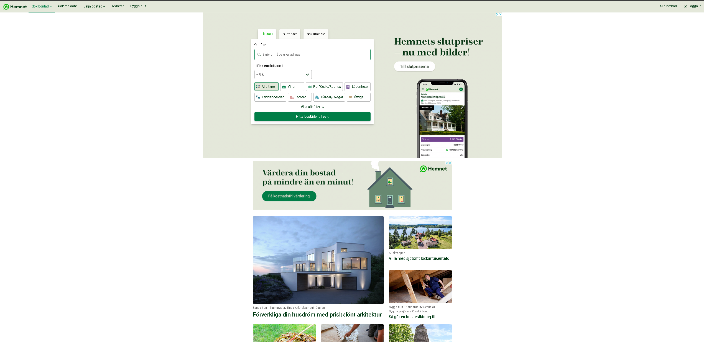
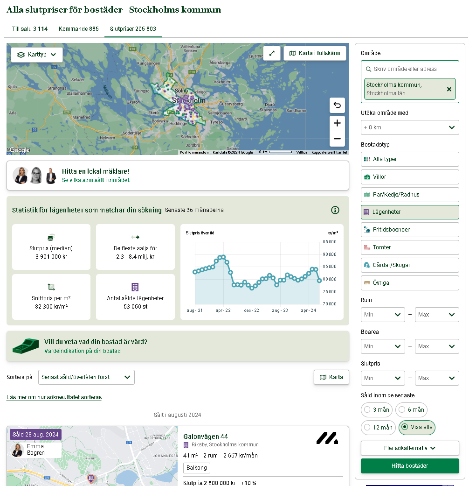

   
  # Webscraping_SE_properties_Hemnet

## Description : 
In this project, I web scrape the website "www.hemnet.se", Swedens biggest property platform. I will gather historical transaction data on properties and their characteristics. 

In order to over come few challenges I utilize the well known and powerful Selenium library to construct by bot.  

Objective: Collect as much data on Swedish properties as possible - in a controlled and respectful manner without overloading their servers (Even though that is unlikely to happen.) 

## Overview of the code : 

Unlike the previous web scraping projects, scraping this website comes with three challenges :

### Challenge 1:
  * "hidden" API: There is no access to a "hidden" API, therefore there is no easy way out where we simply plug in to the API and make few GET requests.
    * Hemnet does host an API, however its use is only for brokers or broker agencies.  

### Challenge 2:
  * Captcha : When I tested couple of simple scripts using BeautifulSoup and ran a few iterations over multiple pages, something seemed to trigger a CAPTCHA. It appears that they monitor users quite effectively. 

### Challenge 3:
  * For each page the site displays 50 properties
  * However, regardless of the search and filter criteria set in place, the site only allows access to 50 pages. Meaning that if we search e.g. for properties in Stockholm municipality wich leads to results of 205.885 properties, then users are only allowed access to 2.500 properties. 

To overcome the first two challenges I use the Selenium package. Unlike BeautifulSoup (which is primarily used as a HTML parser) Selenium allows me to construct a BOT i.e. by using Selenium I can automate interactions with a web browser with a set of instructions which makes my traffic seem like a human and therefore helps prevent getting blocked or trickering a CAPTCHA. 

To over come the third challenge I let the BOT use the filtering criteria offered on the website i.e. property type, number of rooms, property size and transaction price in order to thin out the results below or equal to 2.500 results. 

Following is a description on how the BOT runs: 
  * ***Step 1*** - Iterate through the list of municipalities to find properties in each one.
    * I keep a list of all 290 municipalities of Sweden in a csv file - see folder *Sweden_municipalities_data* (taken from wikipedia)
    * ***Step 2*** - Get the total search results in municipality
      * ***Step 3.1*** - If total search results < 2.500 then loop over each page and extract property data
      * ***Step 3.2*** - If total search results > 2.500 then filter the data
       * ***Step 4*** - Filter data by a set of predefined instructions :
       * During step 4: if any of the filtering criteria is able to achive results below or equal to 2500 results then scrape data else move to next filtering step.
       * Note: For the criteria "number of rooms," "property size," and "transaction prices," I have predefined a set of minimum and maximum values. I based these ranges on what could be considered an "educated" guess (emphasis on the quotations
). The ranges increment by relatively small steps to increase the likelihood of obtaining results below 2,500.
           * ***Step 4.1*** - Filter by *property type*
           * loop over each property type and extract data if results <= 2500
           * ***Step 4.2*** - Filter by *number of rooms*
           * loop over a predefined set of minimum and maximum number of room ranges 
           * ***Step 4.3*** - Filter by *property size*
           * loop over a predefined set of minimum and maximum property size ranges 
           * ***Step 4.4*** - Filter by *transaction price*
           * loop over a predefined set of minimum and maximum transaction price ranges
           * ***Step 4.5*** - Dead end 
           * if the bot has gone over each criteria and the results are still greater then 2.500 then it will simply take what it can get

## Result : 
> [!TIP]
> Although the filtering method works well in reducing the results to below 2,500 in most municipalities, it encountered some issues in the more populous municipalities, namely Stockholm and Gothenburg. One of the main issues with my approach is that I initialize the search.
>
> Unfortunately, that was the smallest administrative boundary in Sweden that I was able to find. However, utilizing street names in combination with municipality names will definitely allow you to extract more data 
> (if you are in the mood for that, it will take some time...) 

* 1.022.572 millions transactions and 1.022.572 properties (1 to 1 ratio i.e. for each property we have 1 transaction)

## Example Data

You can view an example of the tabular data from the final result in the CSV file located in the example_data folder
